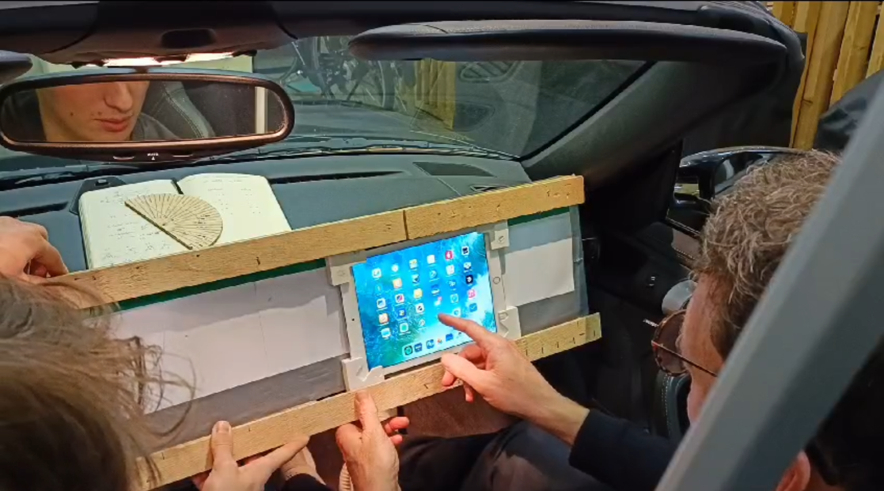
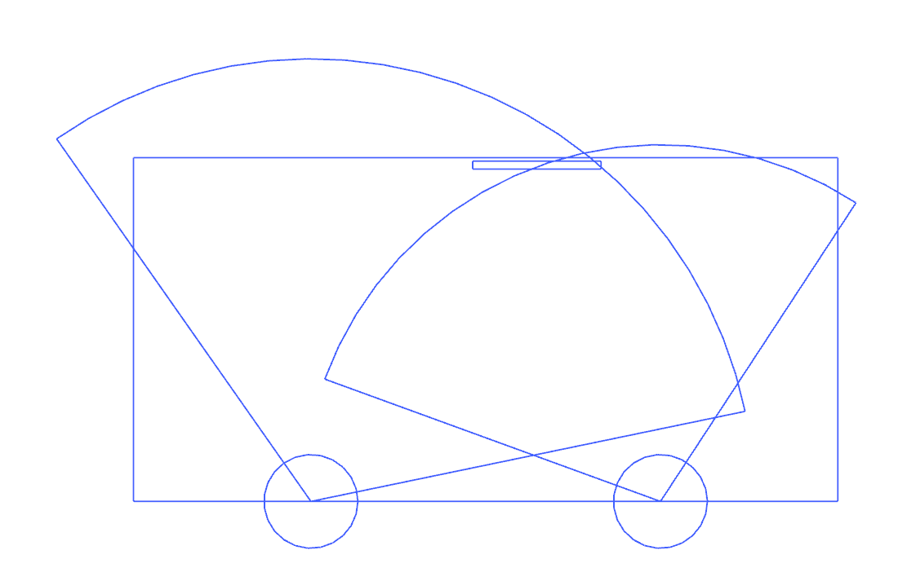

# Deelopdracht 3: Human Body
*Experimenteel nagaan van positie voor onbeschikbaar scherm tijdens rijden* 

*Projectteam: Luca Poppe; Noah Menschaert*

--/--/--

## Samenvatting
<!---
Max 200 woorden. Beschrijf je project in het kort, waarbij je deze vragen zeker beantwoordt:

- Wat is het probleem?
- Hoe heb je dit onderzocht?
- Wat is jouw oplossing?
- Hoe lost jouw oplossing het probleem op?
- Hero sketch/render/image
-->

### Het probleem
Touchscreenconsoles in auto's zijn gevaarlijk om te gebruiken tijdens het rijden. Er zijn veel handelingen nodig om iets aan te passen en de ogen zijn lang van de baan. 

### De oplossing
In het beste geval is er geen touchscreen aanwezig voor de chauffeur. Uit onze interviews is gebleken dat de passagier een belangrijke co-piloot is. Ook vinden gebruikers een touchscreen zeer handig om te gebruiken en dit kan veilig tijdens wanneer ze stilstaan. Om hier rekening mee te houden maken we een touchscreen dat tijdens het rijden enkel voor de chauffeur beschikbaar is. 
De oplossingen zijn als volgt:
- touchscreeninterface voor de passagier
- touchscreen verschuift naar passagier tijdens het rijden
- touchscreen draait weg van chauffeur
- touchscreen heeft polarisatie zodat het enkel zichtbaar is voor passagier

  

> Schets oplossingen met 1: schuivende interface, 2: draaiend scherm, 3: schuivend scherm en 4: gepolariseerd scherm

### Test
Door gebruik te maken van anthropometrische data en een fysieke test wordt nagegaan op welke manier het scherm niet meer beschikbaar is voor de chauffeur en tegelijk makkelijk te gebruiken is voor de passagier. De test wordt uitgevoerd in een auto, waarbij een ipad dient als touchscreen.

## Discovery
### Doelstellingen
De doelstelling van deze proef is om een geschikte methode te vinden die het probleem oplost. Na de test moet duidelijk zijn welk prototype bruikbaar is en hoe die te gebruiken is. Indien geen van de prototypes bruikbaar zijn moeten gerelateerde designrequirements geformuleerd worden en een alternatief voorgesteld.

### Methodologie
#### *Rijkdiepte*
Om het scherm onbruikbaar te maken voor de chauffeur en bruikbaar voor de passagier wordt er rekening gehouden met de reikdiepte wanneer mensen zitten. Voor de bestuurder maken we gebruik van design for the big om zeker te zijn dat het scherm buiten meeste mensen hun bereik ligt. Voor de passagier wordt design for the small gebruikt, zo kunnen passagiers het scherm sowieso gebruiken. Onderstaande tabel toont de data uit DINBelg.

| eenheid mm | P1  | P5  | gem | P95 | P99 | SD  |
|------------|-----|-----|-----|-----|-----|-----|
| reikdiepte | 651 | 685 | 767 | 850 | 884 | 50  |

#### *Draaiing scherm*
Aan de hand van een literatuurstudie wordt gezocht op welke hoeken een scherm gezet kan worden om deze goed/slecht zichtbaar te maken. Volgens een artikel van [TCL USA](https://www.tcl.com/global/en/blog/what-is-the-best-tv-viewing-distance#:~:text=3.,degrees%20from%20left%20to%20right.) is het best om een tv te bekijken op een hoek van maximum 40°. Een [studie van RTINGS](https://www.rtings.com/tv/tests/picture-quality/viewing-angle) toont dat bij 70° problemen als kleur- en gammaverschuiving, kleurverbleking, helderheidverlies en steiging in zwartniveau optreden. Aan de hand van deze bevindingen worden volgende hoeken besturdeerd:
- loodrecht op dashboard
- loodrechts op passagier
- 40° met bestuurder
- 40° met passagier
- 70° met bestuurder
- 90° met bestuurder

#### *Verschuiving*
Voor de schuivende interface wordt positie 0mm (centrum) positie 20mm (voor passagier) en tussenmaat 15 mm bestudeerd. Deze wordt gecombineerd met de draaiing van het scherm.

#### *Analyse schermpositie*
Aan de hand van een tekening wordt de hoek van het scherm ten opzichte van het dashboard berekend voor elke verschuiving en draaiing. Zie onderstaande foto:

  
  

> linkse foto: legende van analyse schermposities

uit de analyse komen volgende hoeken voor Θ:

| y-waarde | loodrecht op passagier | 40° met chauffeur | 40° met passagier | 70° met chauffeur | 90° met chauffeur |
|:---------|:-----------------------|:------------------|:------------------|:------------------|:------------------|
| centrum  | 24°                    | 10°               | 64°               | 37°               | 55°               |
| 15 cm    | 17°                    | 5.2°              | 53°               | 30°               | 47°               |
| 20 cm    | 0°                     | - 6.4°            | 66°               | 22°               | 43°               |

 

#### *uitvoeren test*
Fase 1: passagiersrol

*De testpersoon zit in de passagiersstoel, de interviewer zit in de bestuurdersstoel.*

In deze fase wordt gekeken hoe goed de passagier met het scherm kan werken in de verschillende posities. Alsook welke posities comfortabel zijn.
Voor elke y-waarde doet de passagier een opdracht om het bereik tot het scherm te testen. Voor elke hoek waar het scherm op gezet wordt, evalueert de passagier de zichtbaarheid van het scherm.

    

Opdrachten in deze fase:
- apps openen
- route ingeven in navigatie-app

Fase 2: Chauffeursrol

*De testpersoon gaat nu in de bestuurdersstoel zitten en de interviewer in de passagiersstoel.* 

In deze fase wordt gekeken wanneer het scherm (niet) leesbaar is en hoe groot de drempel is om het scherm te lezen.
Voor elke y-waarde en corresponderende hoeken:
- Chauffeur probeert scherm te lezen vanuit rustpositie.
- Hoe ver moet de chauffeur het hoofd bewegen om het scherm te lezen?  
 *De afstand van hoofd tot rustpositie wordt gemeten.*
- Vanaf welke exacte hoek kan de chauffeur in rustpositie het scherm lezen?
*De exacte hoek wordt gemeten.*

    

Te lezen beelden in deze fase (gesorteerd op moeilijkheid):
- Foto met grote pijlen
- Titel krantenartikel
- Namen liedjes in spotify playlist
- Wikipedia Artikel

#### *Setup test*
Om de test uit te voeren werd een cabrio gebruikt. Een camera filmt het topview van de auto, een andere filmt het dashboard. 

  

> setup camera's

### Resultaten
#### *Analyse rijkdiepte*

Onderstaande foto's schetsen voor elke verschuiving de rijkdiepte van pasasgier bij design fot the small en van chauffeur bij design for the big.

  
  
  

> y-waarde: (links: 0), (middelste: 15), (rechts: 20)

Het is duidelijk dat het touchscreen pas onbereikbaar is zonder te bewegen als het recht voor passagier staat (y = 20).
Bij y = 15 is het scherm net niet buiten het bereik, maar niet heel het scherm is bereikbaar zonder te verplaatsen.

#### *Analyse test passagier*
Onderstaande tabel toont opmerkingen van de gebruikers per positie van het scherm. 

|         | loodrecht op passagier | 40° met chauffeur | 40° met passagier   | 70° met chauffeur | 90° met chauffeur |
|---------|------------------------|-------------------|---------------------|-------------------|-------------------|
| centrum | ok                     | ok                | onhandig            | onhandig          | onhandig          | 
| 15      | ok                     | ok                | onhandig, in de weg | onhandig          | onhandig          |
| 20      | ok                     | -                 | onhandig            | onhandig, vreemd  | onhandig          |

Algemene opmerkingen: Onaangenaam als scherm verder weggedraaid is dan recht naar de passagier toe.

Algemeen is te stellen dat het scherm recht op de passagier of tot 40° van de passagier weggedraaid (richting chauffeur) mag staan.

#### *Analyse test chauffeur* 
Onderstaande grafiek toont de verplaatsing in cm in de y-richting dat de gebruikers afgelden om het scherm te zien.
Dit is enkel wanneer het scherm op 70° of 90° met de chauffeur staat. Voor andere hoeken was het scherm zichtbaar uit neutrale rijpositie.

 

Aan de hand van de gemeten resultaten is er geen duidelijke trend te zien tussen positie van scherm en verplaatsing dat
de chauffeur moet doen. Dit hangt allemaal heel sterk af van de persoon in kwestie. Er is wel een vrij duidelijke hoek
vanaf wanneer de chauffeur het scherm niet meer vanuit rustpositie ziet. Data hiervoor:

|           | centrum | 15  | 20  |
|-----------|---------|-----|-----|
| persoon 1 | 30°     | 25° | 20° |
| persoon 2 | 35°     | 30° | 25° |
| persoon 3 | 35°     | 30° | 25° |
| persoon 4 | 35°     | 30° | 20° |

Het kantelpunt is telkens dicht bij de draaiing waarbij het scherm op 70° met de chauffeur staat.

#### Algemeen
Er zijn geen overeenkomsten tussen de posities die goed zijn voor de passagier en niet afleidend voor de chauffeur.
Het scherm is enkel niet beschikbaar wanneer het ver weg genoeg staat. Een schuivend of draaiend scherm alsook een combinatie
van de twee is geen werkende oplossing voor het probleem.

### Conlcusies en implicaties
Een draaiend of schuivend prototype is niet de oplossing.

**Design requirements:**
- **Bruikbaar passagier:** Scherm is naar passagier gericht.
- **Schuin Onzichtbaar:** Scherm dat onzichtbaar kan zijn zonder weg te draaien.

**Mogelijke oplossing:**
Een scherm die door middel van polarisatie het licht naar de chauffeur kan blokkeren zou aan de design requirements kunnen voldoen.
Dit kan nog in combinatie met een verschuivende interface/scherm om te verzekeren dat de chauffeur het niet meer kan gebruiken.

## Kritische reflectie
De conclusie van deze test is stelt dat geen van de geteste prototypes een goeie oplossing is. De test brengt zo wel resultaten
op, maar zou beter geweest zijn moest ook een scherm met polarisatie getest worden. Verder konden er betere prototypes gemaakt
worden om de testen uit te voeren. De moeilijkheden bij de prototypes is dat deze in een auto gebruikt worden, zo is het meestal
niet mogelijk om de prototypes fysiek te bevestigen in de auto. Om het scherm op de juiste hoeken te zetten werd een gradenboog
gebruikt. Het nadeel hieraan is dat het scherm elke keer opnieuw goed gezet moest worden. Gebruik maken van frames met 
vaste hoeken maakt het mogelijk om snel te wisselen en altijd de juiste en zelfde hoek te gebruiken. Ten slotte is het in cm meten
van de gebruikers hun verplaasting inefficiënt en een te precieze meting.

## Bronnen
sites literatuurstudie:
- Cumming, I., & Di Giovanni, N. (2021, March 2). Viewing Angle of TVs. RTINGS.com. Retrieved May 25, 2024, from https://www.rtings.com/tv/tests/picture-quality/viewing-angle
- What is the Best TV viewing distance. (2022, February 28). TCL. Retrieved May 25, 2024, from https://www.tcl.com/global/en/blog/what-is-the-best-tv-viewing-distance

## Bijlagen
